# **Práctica 2.3: Montado de un sistema de ficheros con chroot**
## **Descripción de la tarea**
En esta práctica se va a hacer uso de una máquina base, la cual va a contar con un usuario y contraseña. La idea es hacer uso de la imagen .iso de otra distribución para poder recuperar el usuario y contraseña en cuestión. Como máquina base se propone Debian y la .iso empleada como live será Kali Linux.
## **Pasos de la tarea**
1. Realiza una instalación desde cero de una máquina virtual con sistema operativo Debian y crea un usuario cuyo nombre sea tu nombre personal.

   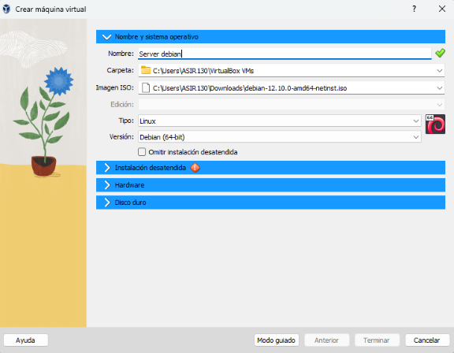

   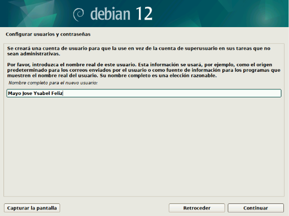

1. En ajustes de VirtualBox, en la parte de almacenamiento añade la imagen ISO de Kali Linux y asegúrate de que en el orden de arranque la opción óptica esté antes del disco duro.

   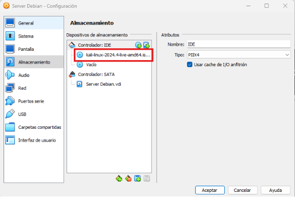

   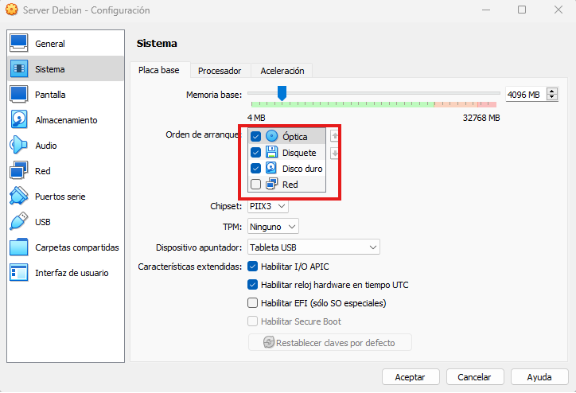

1. Arranca la máquina virtual y comprueba que se inicie con Kali Linux.

   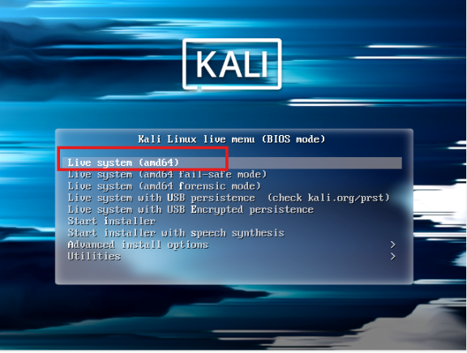

4\. Abre una terminal y realiza los siguientes pasos:

1. Cambiar a castellano el teclado.

1. 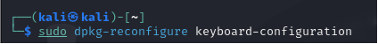

1. 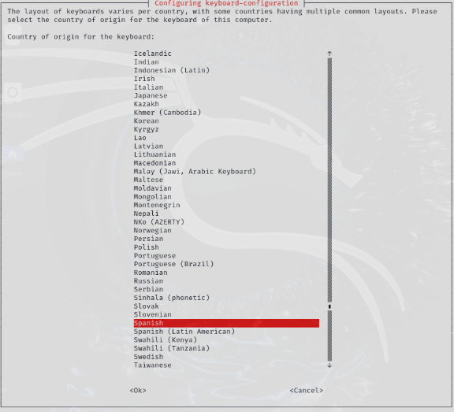

1. 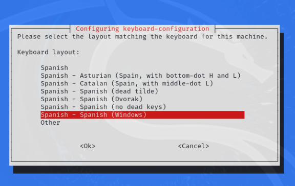

1. Acceder a la consola de root como administrador usando sudo (configurado en /etc/sudoers mediante visudo).

1. 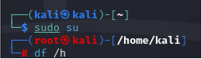

1. Mostrar los sistemas de ficheros montados.

1. 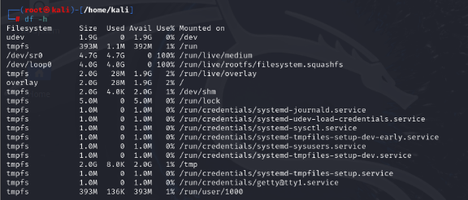

1. Listar la tabla de particiones del disco /dev/sda.

1. 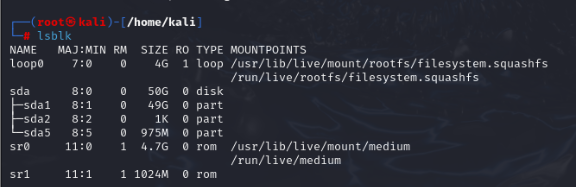

1. **Tabla de particiones:**

1. 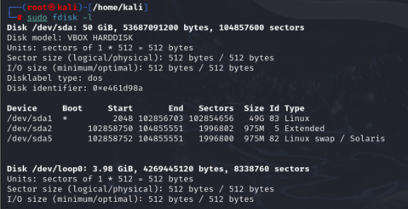

1. Crear el directorio /mnt/recuperar.

1. 

1. 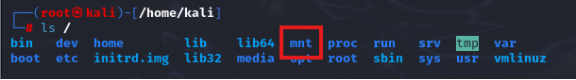

1. 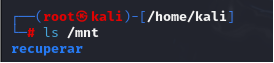

1. Montar /dev/sda1 en /mnt/recuperar con auto-detección de tipo (-t auto).

1. 

1. Montar el directorio /dev dentro de /mnt/recuperar/dev.

1. 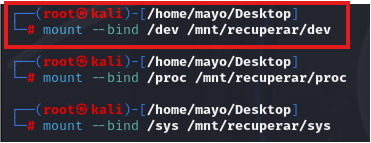

1. Montar el directorio /proc dentro de /mnt/recuperar/proc.

1. 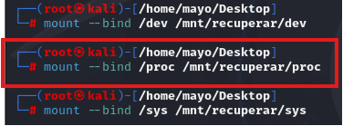

1. Montar el directorio /sys dentro de /mnt/recuperar/sys.

1. 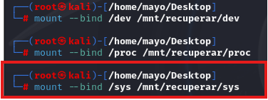

1. Crear una jaula con chroot a /mnt/recuperar.

1. 

1. 

1. Desmonta /mnt/recuperar/dev, /mnt/recuperar/proc, /mnt/recuperar/sys y /mnt/recuperar.

   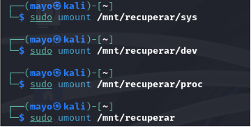

1. Apaga la máquina, quita la ISO de Kali Linux de la configuración y arranca con Debian recuperado.

   **Se quita la óptica de Kali del controlador IDE**

   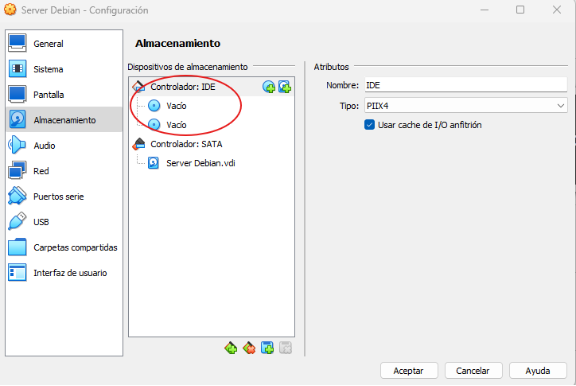

   **Hay que asegurarse de que el disco duro este de primero en el orden de arranque**

   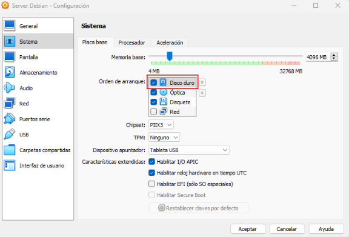
