# 🔧 Objetivo

Configurar dos máquinas virtuales en red y realizar conexiones SSH y
transferencias de archivos usando SCP. Además, documentar el proceso de
conexión por clave pública y el uso de passphrase.

# 🧱 Estructura del entorno

Máquina A (cliente):

\- Usuario creado: alex\
- Puerto SSH redirigido: 2222

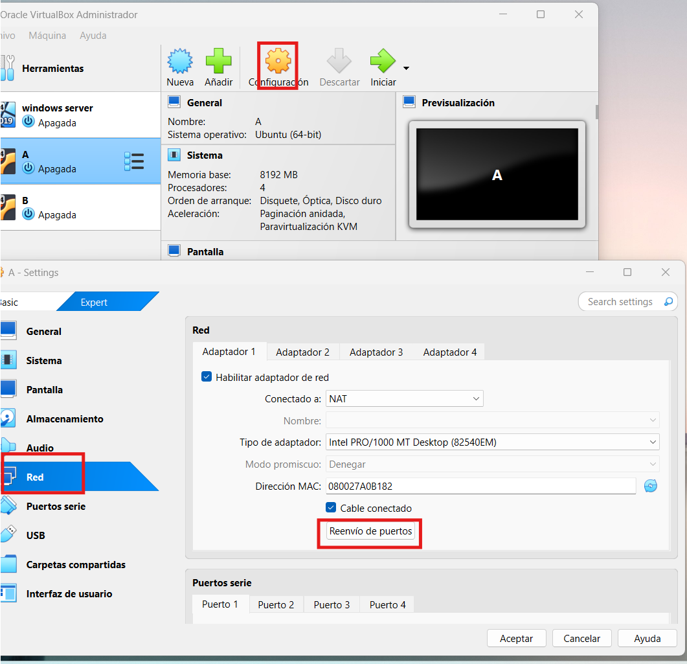{width="4.737957130358705in"
height="4.577283464566929in"}

{width="5.342129265091864in"
height="3.2919520997375327in"}

Máquina B (servidor):

\- Usuario creado: brais\
- Puerto SSH redirigido: 2223

Conexiones SSH realizadas a través de red NAT con reenvío de puertos.

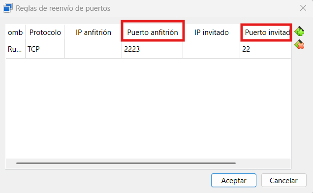{width="5.300459317585302in"
height="3.266949912510936in"}

# 1️⃣ Crear el usuario \'alex\' en la máquina A y \'brais\' en la máquina B.

> 📸 Captura de pantalla:

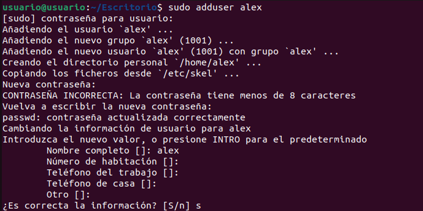{width="6.0in" height="3.004166666666667in"}

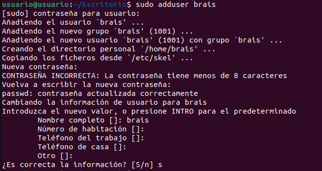{width="5.417135826771654in"
height="2.8835826771653545in"}

# 2️⃣ Conectarse desde la máquina A hacia la máquina B mediante SSH.

> 📸 Captura de pantalla:

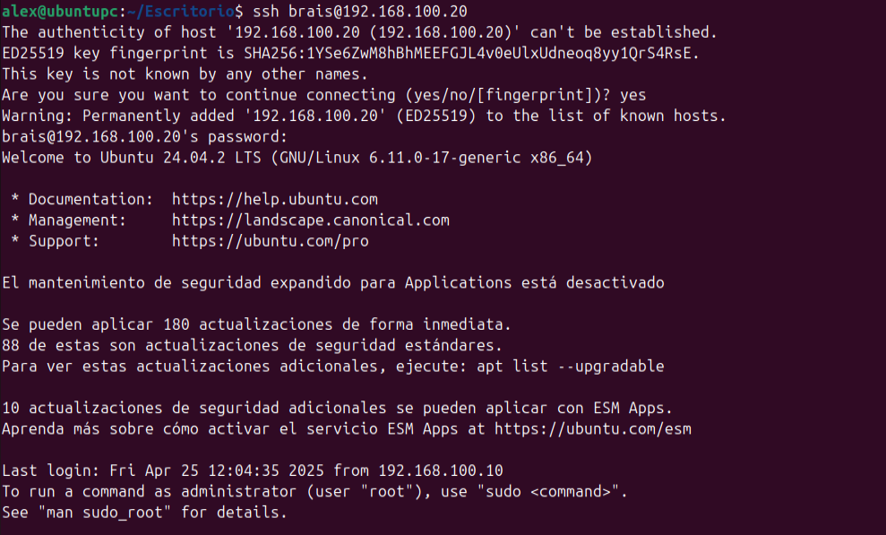{width="6.0in" height="3.6215277777777777in"}

### Cuando te conectas mediante ssh se crea una sesión cifrada. Y si es la primera conexión se guardará una clave publica en /.ssh/known_hosts 

# 3️⃣ Crear el directorio \'prueba\' con el archivo \'prueba.txt\' en la carpeta temporal de la máquina A y enviarlo al servidor.

> 📸 Captura de pantalla:

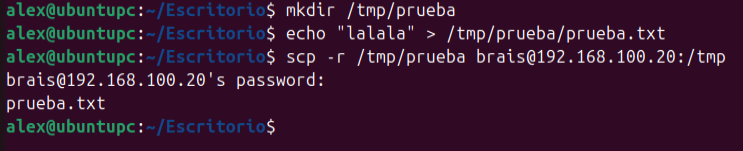{width="6.0in" height="1.2194444444444446in"}

# 4️⃣ Crear el directorio \'prueba2\' con el archivo \'prueba2.txt\' en la carpeta temporal del servidor y enviarlo al cliente.

> 📸 Captura de pantalla:

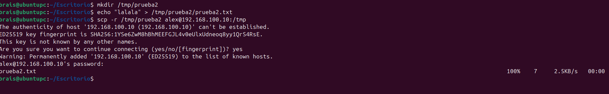{width="7.173413167104112in"
height="1.1166951006124235in"}

# 5️⃣ Transmitir los directorios \'prueba\' y \'prueba2\' al escritorio del ordenador anfitrión.

> 📸 Captura de pantalla:

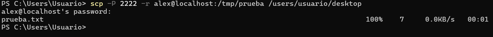{width="6.0in" height="0.4638888888888889in"}

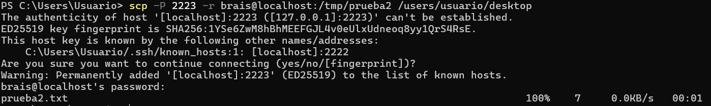{width="6.0in" height="0.9055555555555556in"}

# 6️⃣ Crear el directorio \'prueba3\' con 200 archivos.txt en el servidor y transmitirlo al escritorio del ordenador.

> 📸 Captura de pantalla:

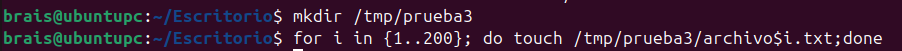{width="6.0in" height="0.3388888888888889in"}

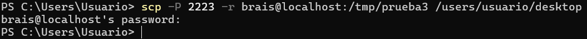{width="6.0in" height="0.40347222222222223in"}

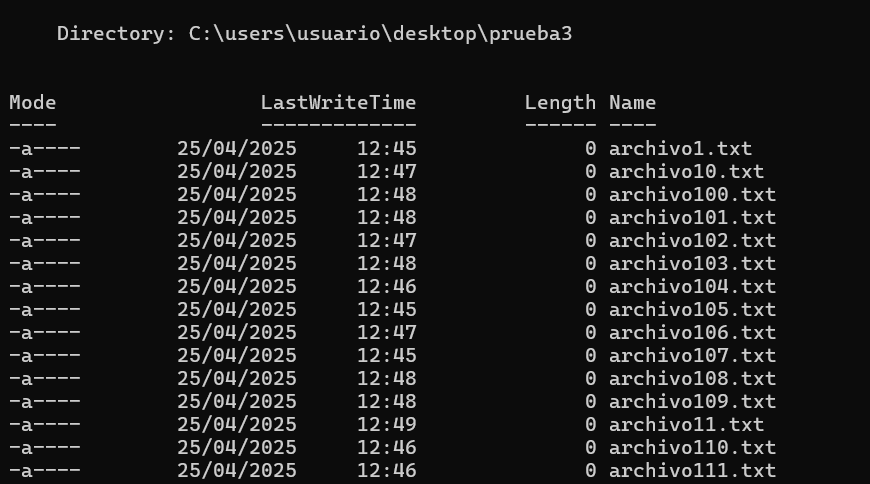{width="6.0in" height="3.3381944444444445in"}

# 7️⃣ Generar un par de claves en el cliente y realizar la conexión al servidor usando clave pública con passphrase \'servidorssh\'.

> 📸 Captura de pantalla:

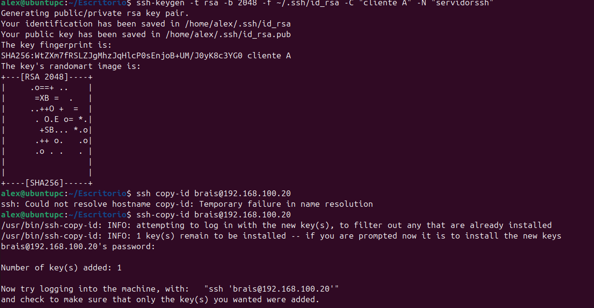{width="6.4948818897637794in"
height="3.3767366579177605in"}
